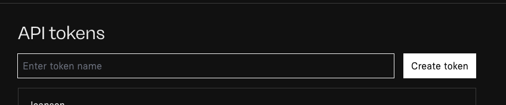
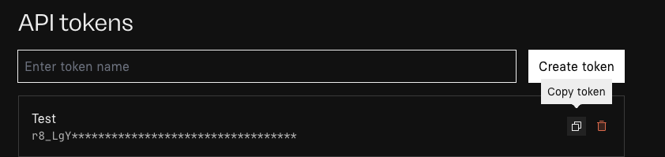
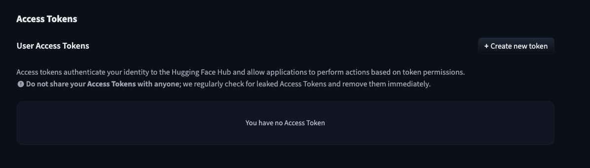
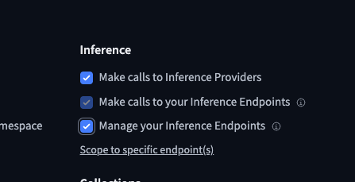
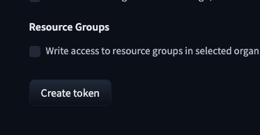
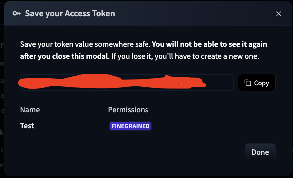
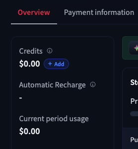

# AI Provider Tutorial  
> **Disclaimer:** *This tutorial covers ONLY provider specific instructions. For all other AI settings, please read [AI Assistant](ai-assistant.md)*
## Overview  
1. Google (Images and Text)
2. OpenAI (Images and Text)
3. Replicate (Images Only) (Advanced)
4. HuggingFace (Images and Text) (Advanced)
5. OpenRouter (Images and Text)  (Advanced)

## 1. Google
- **Step 1:** Login to your Google account or create a [Google AI Studio Account](https://aistudio.google.com/app/).
- **Step 2:** Navigate to the the [Google API Key Page](https://aistudio.google.com/app/api-keys).
- **Step 3:** Click "Create API Key."
> 
- **Step 4:** Create and copy API Key
> 
- **Step 4:** Paste the API key into PUMC and adjust the provider settings in PUMC for your desired model, context size, and image quality.
- **Step 5:** *Optional* - Add money to your Google account with Google Billing. Some models work for free, some need payment. All image models are paid models.

## 2. OpenAI
- **Step 1:** Login to your OpenAI account or create an [OpenAI Account](https://platform.openai.com/signup).
- **Step 2:** Navigate to the [API Keys Page](https://platform.openai.com/api-keys).
- **Step 3:** Click "Create New Secret Key" and then click "Create secret key."
> 
- **Step 4:** Create and copy the new API secret key.
> 
- **Step 5:** Paste the API key into PUMC and adjust the provider settings in PUMC for your desired model, context size, and image quality.
- **Step 6:** Add credit to OpenAI in the [Billing Page](https://platform.openai.com/settings/organization/billing/overview). 

## 2. Replicate (Advanced)
- **Step 1:** Login to your Replicate account or create a [Replicate account](https://replicate.com/).
- **Step 2:** Navitate to the [API Tokens Page](https://replicate.com/account/api-tokens)
- **Step 3:** Enter a token name and click "Create Token."
> 
- **Step 4:** Hover over the newly created token, and click "Copy Token."
> 
- **Step 5:** Paste the API key into PUMC
- **Step 6:** Add credit to your account on the [Billing Page](https://replicate.com/account/billing)
- **Step 7:** Find the desired model based on the art you want and your budget on the [Models Page](https://replicate.com/collections/text-to-image), and paste the model into PUMC. Adjust the image sized based on your budget.

## 2. HuggingFace (Advanced)
- **Step 1:** Login to your HuggingFace account or create a [HuggingFace account](https://huggingface.co/)
- **Step 2:** Navigate to the [Access Tokens Page](https://huggingface.co/settings/tokens)
- **Step 3:** Click on "Create new token"
> 
- **Step 4:** Enter your token name and check these three permissions:
> 
- **Step 5:** Click "Create token"
> 
- **Step 6:** Copy token and paste into PUMC settings
> 
- **Step 7:** Add credits by clicking the "+ Add" button on the [Billing Page](https://huggingface.co/settings/billing)
> 
- **Step 8:** Find the desired model based on the art and text you want and your budget on the [Models Page](https://huggingface.co/models), and paste the model name into PUMC settings.  If using image models, adjust the image quality based on your budget.

## 2. OpenRouter (Advanced)
- **Step 1:** Login to your OpenRouter account or create an [OpenRouter Account](https://openrouter.ai/).
- **Step 2:** Navigate to the [API Keys Page](https://openrouter.ai/settings/keys) and click "Create API Key."
> 
- **Step 3:** Name your API key and click "create."
> 
- **Step 4:** Copy the API key and paste it into PUM settings.
- **Step 5:** Find the desired model based on the art and text you want and your budget on the [Models Page](https://openrouter.ai/models), and paste the model name into PUMC settings.  If using image models, adjust the image quality based on your budget.