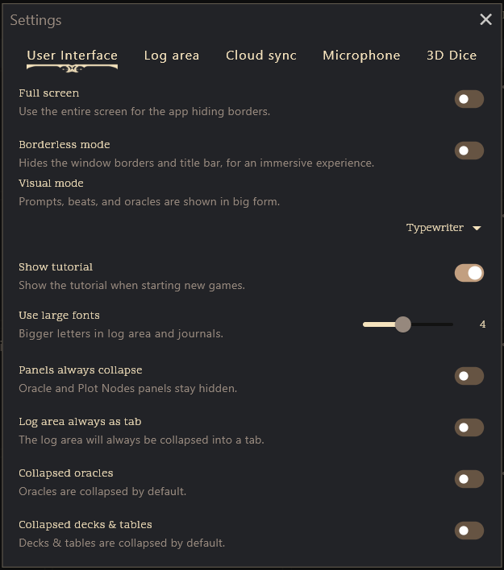

# Game Interface

Welcome to the heart of the PUM Companion app: the in-game interface. This is where your adventure unfolds, your story grows, and all the tools you need are at your fingertips. Whether you’re playing on a desktop, tablet, or phone, the interface adapts to give you the best experience for your device.

---

## Interface Layouts

The interface automatically adjusts to your screen size, collapsing the panels as needed, and allowig you to slide vertical lines to resize them. You can also control the visibility of each panel and resize certain areas manually by dragging the thick dividers between them.

1. Collapse Plot Track (upwards)
2. Oracle Panel Rollout (left side)
3. Plot Nodes Panel Rollout (right side)
4. Dice Roller Panel toggle (bottom)
5. Log/Entities divider (horizontal) - sliding to an extreme edge fully hides
6. Log Area Writing divider (vertical)

### User-Interface Settings

- Full screen: Hides borders (platform specific)
- Borderless mode: Hides window borders (desktop only)
- Use large fonts slider: Adjust the size of the text in the interface for better readability (limited to in-game text)
- Panels always collapsed: Keep the Oracle and Plot Nodes as rollout panels instead of expanding on large screens.
- Log area always as tab: Keeps the log area as a tab instead of a split view with entities on large screens.

### Monitors
Panels are shown side by side, giving you a broad view of your adventure. Starting at 1920x1080 resolution, all panels are visible at once. Typically using the app in window mode allows for multi-tasking, and fits usually the oracles panel to become visible and hides the plot nodes instead.

### Tablets
Panels may stack or slide out as needed, keeping things clear but compact.

### Smartphones
The interface simplifies, showing one main panel at a time. Menus and panels slide in and out so you’re never overwhelmed.

---

## Top bar navigation

- View and edit the game name
- [Manage cloud saves and status](pum-cloud-backup.md)
- Search through your game
- Set the look & feel
    - Architect (Light Theme)
    - [Crystal (Customizable Theme)](https://jeansenvaars.itch.io/pumc-crystal)
    - Darkeye (Dark Theme)
    - Horizon (Glassy Theme)
    - Majesty (Default Theme)
    - Neoflow (Futuristic Theme)
    - Origin (PDF Theme)

### Menu Options

Clicking the menu button (☰) in the top bar opens a panel with helpful options for managing your game and app experience.

- **Activate PUMC Update:** Activate or validate your PUM Companion installation (Windows non-Store version).
- [Join Us on Discord](https://discord.gg/k2rQMa33Kq) Open the official Discord community for help, sharing, and connecting.
- **PUMC Online Hub:** This knowledge base
- **About:** View app info, creators, contributors, and open source attributions.
- **Playing Instructions:** Access the in-app guide for gameplay and features.
- [Keyboard Shortcuts](#keyboard-shortcuts): View all available keyboard shortcuts (desktop only).
- [Settings](pum-application-settings.md): Customize appearance, language, and more in app settings.
- **Continue in a new game:** Duplicate your current game as a new one for fresh arcs or branches.
- [Export Save Game](pum-saving-loading.md): Export your save file for backup or transfer.
- [Share your story](sharing-your-game.md): Share your game in a PDF or markdown text format.
- **Back to main menu:** Return to the main menu/dashboard (prompt to save first).
- **Exit Game:** Close the app (prompt to save before exiting).

---

## Game Search

Search through your journal entries and entity descriptions, as well as quick-access to characters and locations.

- Entity Search: Find characters, locations, and compendiums by their name and quickly navigate to them.
- Log and Entity Content Search: Search through all your journal entries and entity descriptions for keywords or phrases.

### Search shortcuts

- **Ctrl + F** or **Ctrl + Space**: Open the global entity search panel.
- **Ctrl + Arrows** (in Global Search): Move to the next search result.
- **Ctrl + Tab** (in Global Search): Toggle Entity or Log Search
- **Enter** (in Global Search): Open and navigate directly to the selected entity.
- **Shift + Enter** (in Global Search): Speak as the selected character.

---

## Keyboard Shortcuts

- **Ctrl + 1, 2, 3, ...**: Switch to speaking as a specific character (mapped to the corresponding number).
- **Ctrl + 0**: Switch to speaking as the current character.
- **Ctrl + T**: Open a new tab in the interface.
- **Ctrl + W**: Close the currently active tab.
- **Ctrl + Tab** or **Ctrl + Shift + Tab**: Move forward or backward across open tabs.

These shortcuts are designed to streamline your workflow and enhance productivity within the game interface.

---

## Explore each section further

Want to learn more about each part of the in-game interface? Check out their specific pages:

- [Plot Tracks](plot-tracks.md): Edit and visualize your story’s structure.
- [Oracles](oracles.md): Access oracles, random tables, and decks of cards.
- [Log Panel](log-panel.md): Where you read and write your adventure’s journal.
- [Entities Overview](entities-overview.md): Manage your characters, locations, and compendiums.
- [Plot Nodes](plot-nodes.md): Manage and preview your plot nodes with ease.