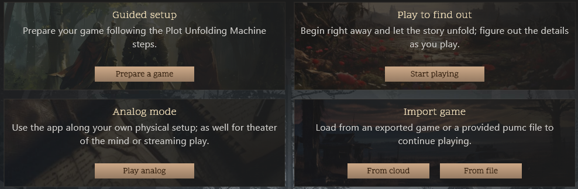
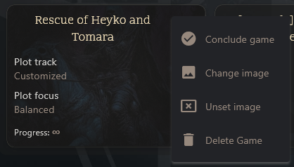
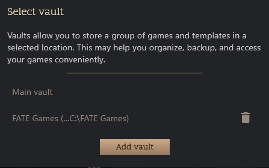
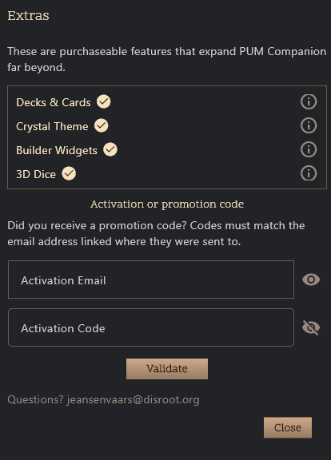

# Main Menu

The Main Menu is the dashboard and entry point of the PUM Companion app. Here you can manage your story games, start new adventures, import/export, and access all core features.

	

## Top Bar

- **Tips & Tricks Button:** Opens a popup with helpful tips for using the app.
- **Extras Menu:** Opens the DLC management popup for PUM Companion.
- **Hamburger Menu:** Opens app-wide settings, help, and about dialogs.
- **Language Selector:** Instantly switch the app language.
- **Look & Feel Selector:** Change themes and visual styles.

## Game Modes

- **Guided Setup (New Game):** Launch the New Game Wizard for a step-by-step setup using the Plot Unfolding Machine method.
- **Play to Find Out (Quick Game):** Instantly start a game with minimal setup using default settings. Good to figure out the app quickly and improvise a game from within.
- **Analog Game:** Enter lightweight mode for inspiration, oracles, and dice (no saving).

### Importing Games

- From File: Import a saved game from your device storage, file-type is `.PUMC`.
- From Cloud: Import a saved game frm your Google Drive account (requires login).

## Game List

Displays all your saved games as cards. Each card shows:
- **Game Name**
- **Plot Type & Focus**
- **Progress Bar:** Visualizes story progress (or ∞ for open-ended games)
- **Cover Image:** If set for the game. You can set or change this via the dropdown menu.

### Game Management

Clicking on a game card will load that game. Clicking the three dots on a game card opens a menu with the following actions:

- **Complete Game**: Marks a game as finished. Games mark themselves as complete when their main Plot Track is finished. Cannot be undone.
- **Change/Delete Image:** Allows to set, change, or remove the cover image for the game.
- **Delete Game:** Permanently deletes the game and all its data from the device.

**Cloud Refresh (if online):** Checks for updates to local games that have a newer cloud backup version. This happens automatically on app start, but you can force a refresh here.

## Vault Picker (PC/Mac Only)

Switch between different save vaults (collections of games). Click to open the vault selection dialog.

- Main vault: The default vault where games are stored, and is always available.
- Additional vaults: Create and switch between multiple vaults to organize your games (e.g., by genre, campaign, or playstyle). Vaults are stored in separate folders on your device.

Deleting vaults from the app DOES NOT delete the vault folder or its games from your device. You can re-add vaults later if you like, or manually delete the vault folder via your file explorer.

## Version Update Banner

If a new version is available, a banner appears with a link to download or apply the update automatically (depending on the platform).

---

## Importing & Exporting Games

- **Import:** Use the Import Game card to bring in games from your device or Google Drive. The app will prompt you if you’re about to overwrite an existing game.
- **Export:** Export options are available from within a loaded game (not directly on the main menu).

---

## Managing EXTRAS

EXTRAS are optional add-ons and features that can be enabled in PUM Companion.

- EXTRAS can be activated in two ways:
	- **In-app purchase** (Google Play Store / Apple App Store)
	- **Serial number activation** (itch.io Serial Numbers)
- Except for Apple devices, the itch.io serial number method works on all platforms.
- All serial numbers are tied to an owner's email address, and all must use the same email for activation.

