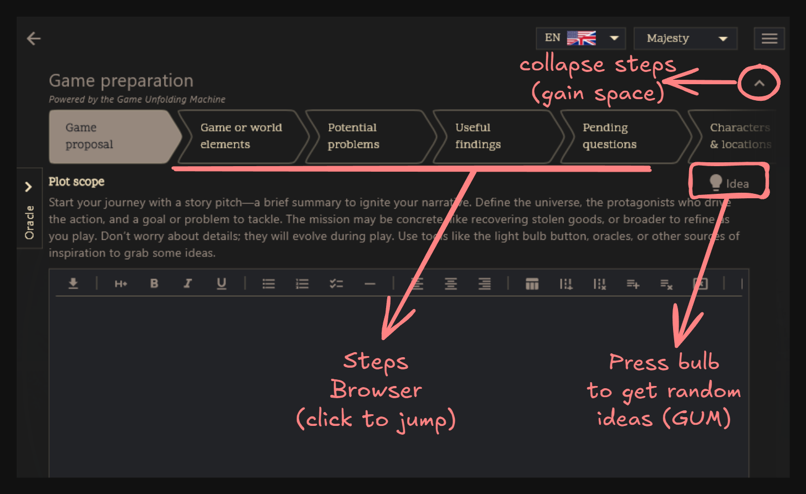
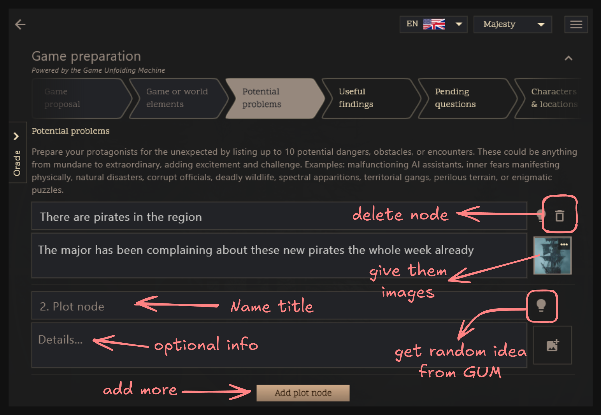
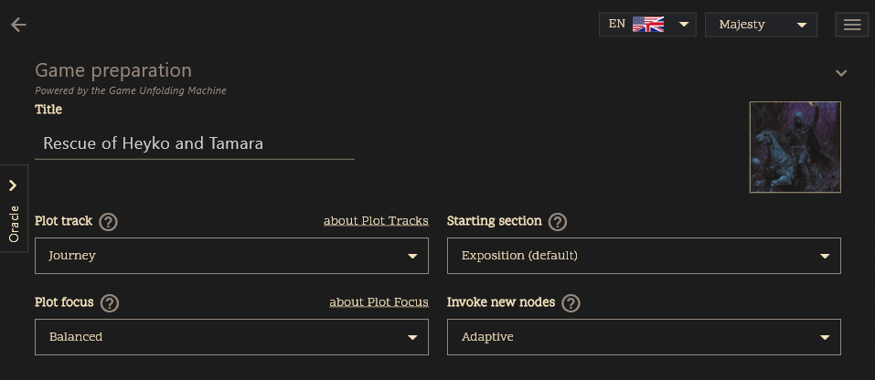

# New Game Wizard

The New Game Wizard helps you set up a new adventure in the PUM Companion app using the Plot Unfolding Machines method expanded by the Game Unfolding Machine. It guides you step by step, making sure you don’t miss anything important—while letting you skip around and fill in details at your own pace.

At the top, you’ll see a row of boxes—each one is a step. Click any box to jump to that step. Move forward or back as you like. Your progress is saved automatically.

---

## Traverse the Plot Nodes

### 1. Plot Scope
Define the overall scope of your story. Is it a full campaign, a short quest, or a single dramatic episode? This helps set the tone and scale for your adventure.

### 2. Game and World Elements
Describe what makes your world unique—magic, technology, geography, factions, or anything else. Add as many elements as you want. You can always add or remove them as your ideas grow.

### 3. Potential Problems
List challenges, conflicts, or obstacles your players might face. These can be personal struggles, external threats, or world events. Use this to inspire tension and drama in your story.

### 4. Useful findings
List items, information, allies, or resources that your protagonists would find helpful. These can be tools, clues, or support systems that aid them on their journey.

### 5. Pending Questions
Write down any unresolved story hooks or mysteries you want to explore later. These can be open questions or plot points you haven’t figured out yet.

### 6. Characters, Locations & Compendiums
Create key characters, important locations, and compendiums (resources, lore, rules, etc.) for your story. You can always expand or modify these later.

For more details on managing entities and its user interface, see the [Entities Overview](entities-overview.md).

### 7. Plot Properties
Choose your story’s structure (Standard, Improvised, Dungeon, etc.) and focus (Balanced, Character-driven, Event-driven). Some options unlock extra settings—look for info icons for more details.

- **Plot Track:** Choose the structure for your story’s progression. The plot track defines the sequence of major beats or scenes. [Learn more about Plot Tracks.](plot-tracks.md)
- **Plot Focus:** Set the balance between your own plot nodes and random events. This controls how much the story follows your planned elements versus surprises. [Learn more about Plot Focus.](plot-focus.md)
- **Starting Section:** Decide where your adventure begins on the plot track. You can start at the beginning, in the middle, or at any key scene. [See Plot Tracks for details.](plot-tracks.md)
- **Invoke New Nodes:** Adjust how often PUMC introduces new, unexpected plot nodes instead of only using the ones you’ve listed. This setting affects the unpredictability and freshness of your story. [See Plot Nodes for more.](plot-nodes.md)
    - Disabled: Only use the nodes you created.
    - Adaptive: Following the PUM rules, new nodes are invoked judging by the amount of existing nodes and the plot focus.
	- Fixed %: New nodes are invoked at a steady rate upon calling Random Prompts.

---

## AI Assistance

If you have the [AI Assistant](ai-assistant.md) (Premium Extra) enabled, you can use the **Robot Icon** at the top of the wizard to configure your AI preferences for this game. This allows the AI to help you generate plot nodes, characters, and locations that fit your specific genre and writing style.

You can also use the **Draft Game** feature to have the AI automatically fill in your plot scope, characters, locations, and initial plot nodes based on a simple prompt, giving you a complete starting point for your adventure.

You can also find **Magic Wand** icons next to many text fields to have the AI suggest content based on what you've already written.

---

## Tips for a Smooth Start

- **Skip around:** You don’t have to finish steps in order. Jump ahead or go back anytime.
- **Auto-save:** Your work is saved as you go.
- **Tooltips & help:** Hover or tap info icons for guidance.
- **Oracle Panel:** Stuck? Open the Oracle Panel (left side) for random inspiration.
- **Cancel anytime:** You can exit the wizard without saving if you change your mind.

---

When you’re ready, finish the wizard to create your new adventure. You can always come back and update your setup as your story grows.

---

*Screenshots and visual guides will appear here to illustrate each step and feature.*
